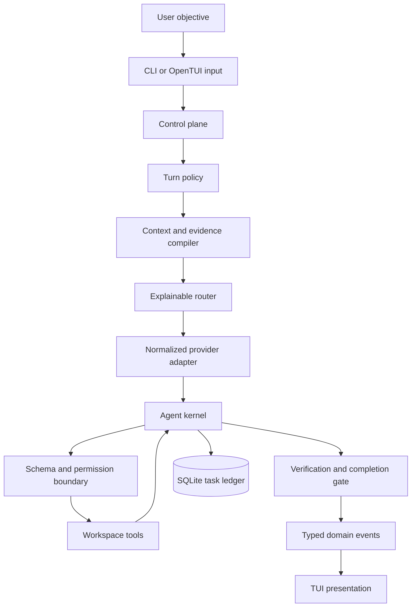

<div align="center">
<pre aria-label="ShelraCode">
░░░░ ░░░░ ░░░░ ░░░░ ░░░░ ░░░░ ░░░ ░░░░ ░░░░ ░░░░ ░░░░
░███ █░░█ ████ █░░░ ███░ ░██░ ░░░ ████ ░██░ ███░ ████
█    █░░█ █    █░░░ █  █ █  █ ░░░ █    █  █ █  █ █
 ██░ ████ ███░ █░░░ ███  ████ ░░░ █░░░ █░░█ █░░█ ███░
░  █ █  █ █  ░ █░░░ █  █ █  █ ░░░ █░░░ █░░█ █░░█ █  ░
███  █░░█ ████ ████ █░░█ █░░█ ░░░ ████  ██  ███  ████
   ░  ░░             ░░   ░░  ░░░      ░  ░    ░
░░░░ ░░░░ ░░░░ ░░░░ ░░░░ ░░░░ ░░░ ░░░░ ░░░░ ░░░░ ░░░░
</pre>
</div>

> A local-first, privacy-aware coding agent for the terminal.

ShelraCode routes repository work through local runtimes first and can use
verified-free cloud capacity when the active privacy and cost policy allows
it. It never silently upgrades to a paid route. The package and CLI are still
named `localcode`; **ShelraCode** is the product name shown by the terminal UI
while the rename is completed.

The central idea is simple:

> A small model becomes substantially more useful when the host owns intent,
> context, tools, permissions, state, recovery, verification, and completion.

ShelraCode is therefore a model-plus-harness system, not a prompt wrapped
around an API call.

## What exists today

This repository contains a working Bun/TypeScript vertical slice with:

- a keyboard-first OpenTUI + SolidJS terminal interface;
- local runtime discovery for LM Studio, Ollama, and llama.cpp-compatible HTTP
  endpoints;
- normalized provider adapters and structured streaming/tool-call handling;
- deterministic turn classification and structural read-only/coding policy;
- repository snapshots, manifest-first context, bounded search and evidence;
- typed workspace tools, path containment, approvals, checkpoints, and stale
  edit protection;
- a multi-turn agent loop with task phases, recovery, compaction and a
  persistent SQLite task ledger;
- host-owned verification and completion gates;
- strict-zero routing with local execution as a first-class route;
- Groq Free quota-bearing capacity and an OpenRouter catalog filtered to free
  model records;
- deterministic fake-provider tests and fixture repositories that do not need
  a live model or paid credentials.

The current 1.5B route is intentionally accessible: if the local model
exposes executable tools and passes the privacy/runtime checks, the router can
attempt it even when its empirical capability probe is only `chat_only` or
`workspace_reader`. That is a route-selection decision, not a claim that a
1.5B model has frontier-level reasoning. Verification still decides whether
the task is complete.

## Current evidence — 2026-08-25

The following was run from the current checkout:

```text
bun run test       -> 474 pass, 1 skip, 0 fail
bun run typecheck  -> PASS
bun run build      -> PASS; current source bundled to dist/index.js
bun run smoke      -> PASS for source and bundle help/version/doctor
```

The real local catalog currently discovers Qwen3 8B, Qwen2.5 Coder 7B, and
Qwen2.5 Coder 1.5B through LM Studio. A direct route check selected
`lm-studio/qwen2.5-coder-1.5b-instruct` for a `DEBUGGING` task with complexity
`0.9` when it was the only candidate; it exposed tools and had zero routing
rejections. That proves the former capability-class stop is removed. It does
not prove that the model will finish every complex repository task.

The verified artifact is the Bun bundle plus OpenTUI's platform runtime
assets. No standalone `.exe` is produced yet.

## Product contract

ShelraCode is designed for people who want useful coding assistance without
requiring a powerful workstation or an unexpected bill.

1. Local inference is preferred whenever an executable local route exists.
2. `strict-zero` is the default and never intentionally selects a paid route.
3. A provider key authenticates a request; it is not proof of free billing,
   privacy, or quota.
4. Remote repository content is subject to privacy and secret gates before
   quality or model preference is considered.
5. A capability label is evidence and a score signal, not authorization. A
   model may be attempted when its tools are executable; host verification can
   still block completion.
6. The model requests actions; the host decides whether those actions are
   allowed.
7. “The model stopped generating” is not the same as “the task is complete.”
8. User Git work is preserved. ShelraCode does not use generic destructive
   rollback commands.

## Quickstart

There is no published package yet. Run the repository directly:

```bash
git clone https://github.com/yosoyjavieruiz/shelra.git
cd shelra
bun install
bun run src/index.ts
```

The first launch opens onboarding for hardware, local runtimes, providers,
privacy, permissions, and routing mode. After onboarding it enters the full
screen TUI. To reopen setup intentionally:

```bash
bun run src/index.ts setup
bun run src/index.ts doctor
bun run src/index.ts doctor --agent
bun run src/index.ts models
bun run src/index.ts providers
bun run src/index.ts config
```

The no-argument command and `--tui` both open the TUI:

```bash
bun run src/index.ts
bun run src/index.ts --tui
```

Build and launch the current bundle:

```bash
bun run build
bun --conditions=browser run dist/index.js
```

## Configuration and free routing

Copy `.env.example` to `.env` for provider configuration. Never commit real
keys or place them in tests, fixtures, screenshots, traces, or issue reports.

```dotenv
GROQ_API_KEY=
OPENROUTER_API_KEY=

LOCALCODE_LM_STUDIO_URL=http://127.0.0.1:1234/v1
LOCALCODE_OLLAMA_URL=http://127.0.0.1:11434
LOCALCODE_LLAMA_CPP_URL=http://127.0.0.1:8080/v1

LOCALCODE_PRIVACY=private
LOCALCODE_ROUTING_MODE=strict-zero
```

The supported free paths do not require a paid subscription:

| Route         | What the key does             | What ShelraCode permits                                         |
| ------------- | ----------------------------- | --------------------------------------------------------------- |
| Local runtime | No key required               | Local inference; no cloud transmission                          |
| Groq          | Authenticates the API request | Free quota-bearing capacity; quota/health can end the route     |
| OpenRouter    | Authenticates the API request | Only `:free`, `openrouter/free`, or zero-priced catalog entries |

Groq and OpenRouter may still impose their own account, rate, availability,
or service terms. ShelraCode does not treat a key as permission to charge an
account. In `strict-zero`:

- paid cloud candidates are excluded;
- paid model records exposed by a free-cloud catalog are excluded before
  routing;
- stale, unknown-billing, or exhausted free capacity is rejected;
- a free-provider failure can fall back to another eligible local/free route,
  never to a paid route;
- private remote use requires the repository privacy policy and current ZDR
  evidence where applicable.

The related implementation and current provider boundaries are documented in
[`docs/PROVIDERS.md`](docs/PROVIDERS.md), [`docs/PRIVACY.md`](docs/PRIVACY.md),
and [`docs/ROUTING.md`](docs/ROUTING.md).

## Architecture

ShelraCode is one Bun package with explicit boundaries. The TUI is a client of
the application state; it is not the agent kernel.



The source ownership is intentionally visible:

| Layer          | Active source                                                         | Responsibility                                                                     |
| -------------- | --------------------------------------------------------------------- | ---------------------------------------------------------------------------------- |
| Entry point    | `src/index.ts`                                                        | CLI command parsing and launch                                                     |
| Control plane  | `src/cli/control-plane.ts`                                            | Settings, SQLite, hardware, runtime and provider discovery                         |
| Turn policy    | `src/agent/turn-policy.ts`                                            | Classifies intent and derives tool/read/write/network policy                       |
| Context        | `src/context/*`                                                       | Repository snapshot, manifests, instructions, commands and evidence sufficiency    |
| Router         | `src/router/*`                                                        | Task analysis, privacy/cost/tool/context/health/quota gates, score and explanation |
| Agent kernel   | `src/agent/loop.ts`                                                   | Model turns, normalized tool calls, observation, recovery and task lifecycle       |
| Tools          | `src/tools/*`                                                         | Validated filesystem, Git, shell and test operations                               |
| Providers      | `src/providers/*`                                                     | Cloud discovery, streaming, quota and failure normalization                        |
| Local runtimes | `src/runtimes/*`                                                      | LM Studio, Ollama and OpenAI-compatible local runtime discovery                    |
| Safety         | `src/privacy/*`, `src/shared/paths.ts`, `src/checkpoint/*`            | Secret filtering, workspace boundaries, checkpoints and preservation               |
| Verification   | `src/agent/verification-plan.ts`, `verifier.ts`, `completion-gate.ts` | Host-owned verification and truthful completion                                    |
| Persistence    | `src/storage/database.ts`                                             | Settings, sessions, routes, quotas, checkpoints and task ledgers                   |
| Presentation   | `src/tui/presentation/*`, `src/tui/components/*`                      | Maps domain events to OpenTUI/Solid views                                          |

Core business logic does not import TUI code. Provider-specific wire objects
stop at adapters. Local runtime differences stop at the runtime adapter. The
kernel receives normalized model events and structured tool results.

## End-to-end execution flow

For every submitted objective, the host follows this shape:

```text
input
  → classify turn and task
  → derive permissions and available tools
  → build bounded repository context when needed
  → discover executable candidates
  → apply hard privacy/cost/tool/context/health/quota gates
  → score capability evidence and route quality
  → select and explain a candidate
  → stream normalized assistant text/tool events
  → validate, authorize, and execute tools
  → feed typed observations back to the model
  → update task ledger and recover or replan
  → run host verification
  → review objective, diff, blockers, and user-work preservation
  → complete, fallback, block, fail, or cancel
```

### 1. Turn policy comes before the model

The host resolves one of these modes:

| Mode                 | Repository read | Repository write |             Shell | Purpose                           |
| -------------------- | --------------: | ---------------: | ----------------: | --------------------------------- |
| `conversation`       |              No |               No |                No | Greetings and normal chat         |
| `knowledge`          |              No |               No |                No | General technical questions       |
| `workspace_question` |             Yes |               No |                No | Evidence-based repository answers |
| `plan`               |             Yes |               No |                No | Read-only analysis and planning   |
| `review`             |             Yes |               No |                No | Read-only inspection and critique |
| `coding`             |             Yes |              Yes | Yes, policy-bound | Implement, test and repair        |
| `command`            |     Safe subset |               No |      Policy-bound | Local slash/diagnostic commands   |

`Hola` therefore creates a model request with no repository tools. A model
cannot widen a read-only policy by emitting `EditFile`, `WriteFile`, or `Shell`.

### 2. Context is compiled, not dumped

Repository context starts with cheap host-owned facts:

1. Git root, branch, status and top-level entries;
2. manifests and language configuration;
3. source/test roots and build files;
4. scoped `AGENTS.md`/instruction files;
5. project command profile;
6. targeted search and bounded line-range reads.

The context builder records evidence with provenance and relevance. Fresh
observations outrank memory. Skills and specialized procedures are not loaded
as general repository context. Large files, command output and old transcript
turns are bounded or compacted; raw artifacts remain outside the active model
context.

### 3. Routing has hard gates and soft signals

The active router does not treat every model capability label as a hard gate.
Its policy boundary is:

```text
privacy and secret policy
  → strict-zero / paid boundary
  → required executable tools
  → usable context
  → health and circuit breaker
  → quota freshness and headroom
  → score and selection
```

Capability probes (`chat_only`, `workspace_reader`, `coding_agent`,
`advanced_coding_agent`) are now a bounded quality signal. They influence task
fit and candidate preference, but a weaker or missing probe does not by itself
produce `STOP · ASK USER` when an otherwise policy-valid candidate exposes the
tools needed for the task. This is what keeps a 1.5B local route usable for
general users. The host may still block the task later if tools fail,
verification is red, progress stops, or the model cannot satisfy the objective.

The routing view exposes the selected provider/model, policy, score, signals,
and rejection reasons. A stop is reserved for an actual hard blocker such as
privacy, paid policy, no executable adapter, missing tools, insufficient
context, unhealthy runtime, stale free metadata, or exhausted quota.

### 4. Adapters normalize providers

The kernel never receives LM Studio, llama.cpp, OpenAI, Groq, or OpenRouter
wire objects. Adapters convert them to a provider-independent event stream:

```text
assistant.text.delta
tool.call.started
tool.call.arguments.delta
tool.call.completed
usage
response.completed
response.failed
```

Partial tool arguments are buffered by call ID and parsed only when complete.
Tool JSON never enters the assistant Markdown transcript. Provider failures
are normalized into actionable categories such as capacity, authentication,
quota exhaustion, timeout, malformed response, or unsupported capability.

### 5. The agent kernel owns the loop

The task ledger advances through observable phases:

```text
frame → discover → analyze → plan → act → observe → reflect
      → verify → review → complete
```

Errors are observations, not automatically terminal failures. Examples:

- `ReadFile` with omitted `maxChars` uses a positive bounded default;
- `maxChars: 0` returns typed `INVALID_ARGUMENT`;
- `ListFiles` on a file returns `PATH_IS_FILE`, not raw `ENOTDIR`;
- a failing test returns `TEST_FAILED` evidence for the next turn;
- a stale edit returns `EDIT_CONFLICT` and requires a fresh read;
- a pre-mutation provider failure may trigger a bounded route fallback;
- a post-mutation failure does not silently move the task to another model.

The non-progress watchdog detects repeated calls, repeated errors, no new
evidence, and oscillating edits. It is a safety mechanism, not a user quota.

### 6. Completion is host-owned

For coding work, “done” requires evidence such as:

- the objective's required changes were actually applied;
- configured verification commands were attempted and passed;
- required criteria are satisfied when a task-specific verifier exists;
- the final diff/status review succeeded;
- no unresolved blocker remains;
- pre-existing user work is preserved.

The model can propose completion, but it cannot declare a failing verification
successful. A blocked or cancelled task is represented as such in the ledger
and UI.

## Tools and safety boundary

The MVP tool inventory is deliberately small:

| Tool         | Scope                                           |
| ------------ | ----------------------------------------------- |
| `ListFiles`  | Bounded directory listing                       |
| `GlobFiles`  | Bounded filename discovery                      |
| `SearchText` | Ripgrep/fallback text search with line previews |
| `ReadFile`   | Bounded content and line-range reads            |
| `EditFile`   | Exact/stale-aware edits                         |
| `CreateFile` | New file only; refuses `PATH_EXISTS`            |
| `WriteFile`  | Full-content create/overwrite with evidence     |
| `DeleteFile` | One-file delete with destructive approval       |
| `Shell`      | Policy-bound, timed, bounded command execution  |
| `RunTests`   | Discovered project verification commands        |
| `GitStatus`  | Structured worktree state                       |
| `GitDiff`    | Bounded final-diff inspection                   |

Every request passes through:

```text
model request
  → schema validation
  → turn-policy check
  → workspace/path boundary
  → permission and risk policy
  → approval when required
  → execution
  → typed result
```

Mutation results are explicit rather than inferred from a spinner:
`created`, `overwritten`, `edited`, and `deleted` include the workspace-
relative path, before/after existence, bounded `+`/`-` line changes, and a
truncation/redaction marker when content cannot be shown. A failed request is
rendered as `BLOCKED` with its typed error and recovery action; it is never
presented as a successful write. Missing parents, file-vs-directory mistakes,
workspace escapes, stale edits, and approval denials are reported before
mutation.

`CreateFile` cannot overwrite. `EditFile` requires an observed existing file
and an exact replacement. `WriteFile` may create or overwrite a file, but its
result says which operation actually happened. `DeleteFile` is file-only,
checkpointed, and destructive-approval gated; directories are never removed
recursively by this tool surface.

Before mutation, ShelraCode records the relevant worktree/file checkpoint. It
does not use `git reset --hard`, `git clean -fd`, or `git checkout -- .` as a
generic recovery strategy. External edits are detected rather than silently
overwritten.

Secret-shaped paths and high-confidence secret content are excluded from
remote context. Keys are read from the environment and are not written to
logs, task memory, fixtures, or screenshots. There is no remote telemetry by
default.

## Terminal UI architecture

OpenTUI + SolidJS renders typed presentation events produced by the application
event bus. It does not parse provider JSON, grant tools, classify intent, or
decide completion.

The UI is organized around:

- a quiet header with repository/branch and route context;
- one transcript viewport and a fixed composer column;
- streaming assistant text without remounting the message;
- compact specialized tool rows and expandable groups;
- plan and verification progress sourced from the task ledger;
- `AgentMatrixPulse` only for abstract phases such as thinking/discovery;
- concrete tool/test rows instead of competing global spinners;
- explicit `READ`, `CREATE`, `EDIT`, `OVERWRITE`, `DELETE`, and `BLOCKED`
  rows with requested paths, payload sizes, and bounded diffs;
- safe model-progress metadata (`MODEL ANALYSIS`, character count, streaming
  state) without exposing private chain-of-thought;
- stable scroll-follow behavior and a “new activity” state;
- cancellation, resize, narrow-terminal, `NO_COLOR`, and reduced-motion paths.

The TUI is tested at 80, 100, 120, 140, 160, and 200 columns in the current
renderer/integration suite. Visual captures and UI-specific decisions live in
[`docs/TUI.md`](docs/TUI.md) and [`docs/ui-chat-v2/`](docs/ui-chat-v2/).

## Verification and development commands

Use the repository's canonical scripts:

```bash
# formatting, types, deterministic tests, bundle and CLI smoke
bun run format:check
bun run typecheck
bun run test
bun run build
bun run smoke
```

The package test script supplies `--conditions=browser`, which is required by
the OpenTUI/Solid runtime. `bun test` without that condition is not an
equivalent release check.

Focused functional coverage:

```bash
bun run test:functional
bun test tests/unit/router.test.ts
bun test tests/integration/functional-acceptance.test.ts
```

Live provider/model tests are intentionally separate from deterministic CI.
CI does not require LM Studio, llama.cpp, Groq, OpenRouter, or real API keys.

## What is still missing

ShelraCode is not yet a drop-in parity claim for Claude Code, Codex, Cursor,
OpenCode, or any other frontier-backed product. The main remaining gaps are:

### High priority

1. **Long-horizon local-model evidence.** A 1.5B model can now be selected and
   can be useful for bounded work, but arbitrary multi-file refactors,
   architecture migrations, and deep debugging still need a reproducible
   matrix across model, quantization, runtime, chat template, hardware, and
   harness version.
2. **Semantic completion coverage.** The kernel has structural verification and
   supports task-specific criteria, but the product still needs stronger
   objective-aware verifiers for broad natural-language requirements.
3. **Low-resource context quality.** More retrieval, staged planning and
   compaction evaluations are needed on large/noisy repositories so small
   models receive the next useful decision instead of a giant prompt.
4. **Live free-provider evidence.** Catalog discovery and no-paid filtering are
   covered; account-specific free quota, provider privacy, rate limits, and
   remote inference journeys remain volatile and must be rechecked per account.

### Product/release work

5. **Standalone executable packaging.** The current release artifact is
   `dist/index.js` plus platform-specific OpenTUI assets; no native `.exe`
   installer is published.
6. **Hardware recommendation depth.** `llmfit` integration has a fallback, but
   this machine did not have `llmfit` installed during the latest evidence run.
7. **Delegation.** Explore/Build/Verify subagents, isolated worktrees, and
   stronger lower-level shell sandboxing are not yet part of the v0.1 runtime.
8. **Provider surface.** Cloudflare Workers AI, Gemini, and OpenCode Zen are
   intentionally not automatic free routes. They need current contract,
   privacy, quota, and billing evidence before being advertised.
9. **Packaging/public release.** There is no published package, hosted account
   system, team mode, marketplace, background daemon, remote agent, browser
   automation, voice layer, or product-level multi-agent service in v0.1.

These are known gaps, not hidden failures. The authoritative evidence is kept
in [`docs/STATUS.md`](docs/STATUS.md),
[`docs/agent-kernel/STATUS.md`](docs/agent-kernel/STATUS.md), and
[`docs/ACCEPTANCE.md`](docs/ACCEPTANCE.md). Historical audit snapshots are
retained and marked as historical when newer runtime policy supersedes them.

## Documentation map

| Topic                                     | Document                                                                                                                                               |
| ----------------------------------------- | ------------------------------------------------------------------------------------------------------------------------------------------------------ |
| Product thesis, target user and non-goals | [`docs/PRODUCT.md`](docs/PRODUCT.md)                                                                                                                   |
| Layered architecture and ownership        | [`docs/ARCHITECTURE.md`](docs/ARCHITECTURE.md)                                                                                                         |
| Privacy, secrets and remote boundaries    | [`docs/PRIVACY.md`](docs/PRIVACY.md), [`docs/SECURITY.md`](docs/SECURITY.md)                                                                           |
| Routing, strict-zero and explainability   | [`docs/ROUTING.md`](docs/ROUTING.md)                                                                                                                   |
| Provider adapters and free-capacity rules | [`docs/PROVIDERS.md`](docs/PROVIDERS.md)                                                                                                               |
| Agent-kernel architecture and lifecycle   | [`docs/agent-kernel/ARCHITECTURE.md`](docs/agent-kernel/ARCHITECTURE.md)                                                                               |
| Tool contracts and error recovery         | [`docs/agent-kernel/TOOLS.md`](docs/agent-kernel/TOOLS.md), [`docs/agent-kernel/ERRORS.md`](docs/agent-kernel/ERRORS.md)                               |
| Context and verification                  | [`docs/agent-kernel/CONTEXT-ENGINE.md`](docs/agent-kernel/CONTEXT-ENGINE.md), [`docs/agent-kernel/VERIFICATION.md`](docs/agent-kernel/VERIFICATION.md) |
| Model probes and current live evidence    | [`docs/agent-kernel/MODEL-CAPABILITIES.md`](docs/agent-kernel/MODEL-CAPABILITIES.md)                                                                   |
| Current status and acceptance evidence    | [`docs/STATUS.md`](docs/STATUS.md), [`docs/ACCEPTANCE.md`](docs/ACCEPTANCE.md)                                                                         |
| TUI behavior and visual contracts         | [`docs/TUI.md`](docs/TUI.md), [`docs/ui-chat-v2/`](docs/ui-chat-v2/)                                                                                   |
| Agent-v1 audit package                    | [`docs/agent-v1/`](docs/agent-v1/)                                                                                                                     |

## Contributing

Read [`AGENTS.md`](AGENTS.md) before making changes. In particular:

- preserve unrelated user work;
- keep privacy and cost gates ahead of model quality;
- keep provider wire formats out of the kernel;
- use typed domain errors and `AbortSignal`;
- test behavior through the actual source/bundle path, not only isolated
  types;
- never claim a feature is ready without current command or interactive-path
  evidence.

The project deliberately values a smaller, explainable, verifiable local
vertical over a larger list of model names. If a model is weak, the harness
should make its next decision smaller, its context more relevant, its tools
safer, and its completion claims truthful.
